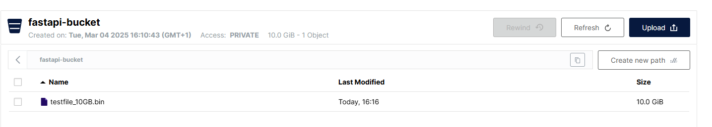
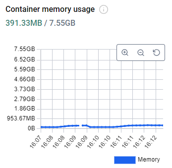

This is a repo meant to test the chunk-by-chunk upload of large file with fast api and s3.

### Reproduce:

start the services
```shell
docker compose up --build
```

Create file(powershell):
```
fsutil file createnew .\testfile_10GB.bin 10737418240
```

now go to localhost:8000/docs, upload the file using try.

### Results




